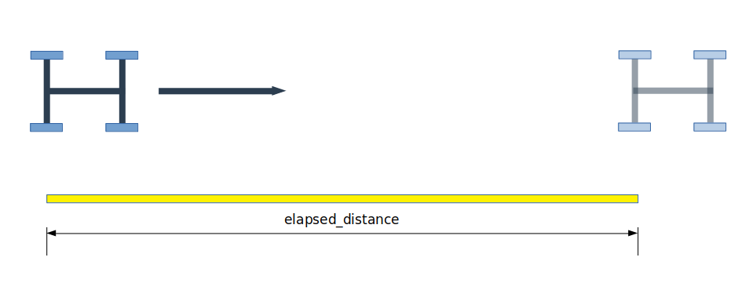
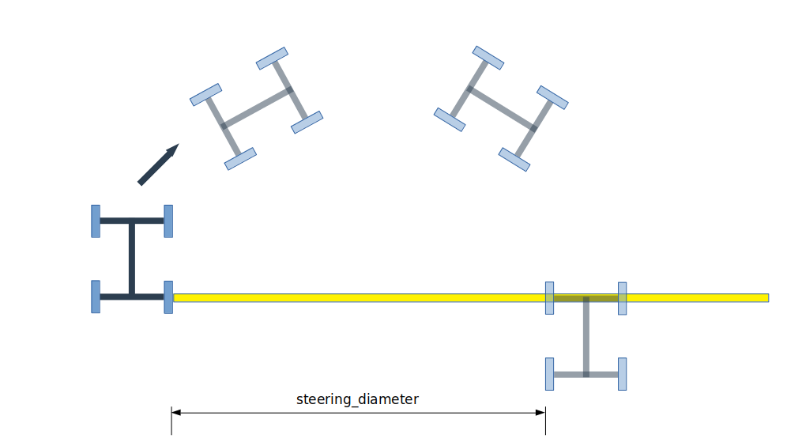

## Calibration Procedure:

### Preliminary
1. Measure the `wheelbase` (perpendicular distance between centerline of axles)
2. Find a tape measure + stopwatch
3. Grab all the dependencies by running the following from the root directory of this repo:
```
julia --project -e "using Pkg; Pkg.instantiate()"
```
4. Use SI units (radians, meters, seconds)

### Speed Measurements

1. Arrange vehicle and tape measure as follows:

    Note: The longer the tape measure, the more accurate your final estimate will be.
2. For a variety of different commanded speeds (at least two fairly different speeds), measure the time, `elapsed_time`, it takes to traverse `elapsed_distance`. Additionally, record the reported VESC `erpm` (normally found at "/vesc/sensors/core" as `msg.state.speed`) for each trial.
3. Store your samples in a CSV files as follows:
```
erpm, elapsed_distance, elapsed_time
val, val, val
val, val, val
....
```

### Steering Measurements
1. Arrange vehicle and tape measure as follows:

Note: It is critical that the measuring tape's primary axis
is colinear with the vehicle's rear axle. You can use a carpenter square or box to help acheive this.
2. For at least two different commanded steering angles, drive the vehicle until its rear axle is again colinear with the measuring tape as shown in the above figure. Record the `steering_diameter` as well as the VESC `servo_position`, (normally found at "/vesc/sensors/servo_position_command" as `msg.data`).

    Note: Left vs right turns matter! The measuring tape itself forms the "x-axis" on a 2D plane (positive x is rightward in the above figure). In this figure the vehicle is turning to the right, so `steering_diameter` is positive. If it was turning the other direction, `steering_diameter` would be negative.

3. Store your samples in a CSV files as follows:
```
servo_position, steering_diameter
val, val, val
val, val, val
....
```

### Compute
1. Execute `calibrate.jl` from the root directory of the repo, passing the wheelbase and two CSVs as follows:
    ```
    julia --project calibrate.jl <wheelbase> <straight_samples_csv_path> <turn_samples_csv_path>
    ```

2. The script will fit a linear-least-squares model to the data and print out the gains + offsets as follows:

    ```
    speed2erpm_gain: 600.0
    speed2erpm_offset: 3.734175251331006e-14
    steering2servo_gain: 0.5560393226142678
    steering2servo_offset: 0.013781793828896521
    ```
    where
    ```
    speed = (erpm - speed2erpm_offset) / speed2erpm_gain
    steering_angle = (servo_position - steering2servo_offset) / steering2servo_gain
    ```

For an example with made up data, run:
```
julia --project calibrate.jl 0.33 straight.csv turn.csv
```
